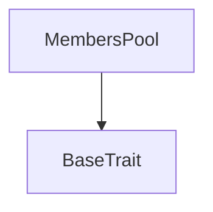
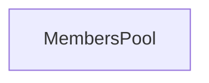

# TACT Compilation Report
Contract: MembersPool
BOC Size: 714 bytes

# Types
Total Types: 42

## StateInit
TLB: `_ code:^cell data:^cell = StateInit`
Signature: `StateInit{code:^cell,data:^cell}`

## StdAddress
TLB: `_ workchain:int8 address:uint256 = StdAddress`
Signature: `StdAddress{workchain:int8,address:uint256}`

## VarAddress
TLB: `_ workchain:int32 address:^slice = VarAddress`
Signature: `VarAddress{workchain:int32,address:^slice}`

## Context
TLB: `_ bounced:bool sender:address value:int257 raw:^slice = Context`
Signature: `Context{bounced:bool,sender:address,value:int257,raw:^slice}`

## SendParameters
TLB: `_ bounce:bool to:address value:int257 mode:int257 body:Maybe ^cell code:Maybe ^cell data:Maybe ^cell = SendParameters`
Signature: `SendParameters{bounce:bool,to:address,value:int257,mode:int257,body:Maybe ^cell,code:Maybe ^cell,data:Maybe ^cell}`

## WalletData
TLB: `_ balance:int257 owner:address master:address code:^cell = WalletData`
Signature: `WalletData{balance:int257,owner:address,master:address,code:^cell}`

## MemberData
TLB: `_ totalVoted:int257 lastClaimed:int257 subscribedUntil:int257 jettonsToClaim:int257 inviter:address poolWithdrawnAt:int257 = MemberData`
Signature: `MemberData{totalVoted:int257,lastClaimed:int257,subscribedUntil:int257,jettonsToClaim:int257,inviter:address,poolWithdrawnAt:int257}`

## TokenWallet$Data
TLB: `null`
Signature: `null`

## Deploy
TLB: `deploy#946a98b6 queryId:uint64 = Deploy`
Signature: `Deploy{queryId:uint64}`

## DeployOk
TLB: `deploy_ok#aff90f57 queryId:uint64 = DeployOk`
Signature: `DeployOk{queryId:uint64}`

## FactoryDeploy
TLB: `factory_deploy#6d0ff13b queryId:uint64 cashback:address = FactoryDeploy`
Signature: `FactoryDeploy{queryId:uint64,cashback:address}`

## PoolData
TLB: `_ totalIncome:coins master:address = PoolData`
Signature: `PoolData{totalIncome:coins,master:address}`

## IncomeEvent
TLB: `income_event#89b87fab amount:coins = IncomeEvent`
Signature: `IncomeEvent{amount:coins}`

## MembersPool$Data
TLB: `null`
Signature: `null`

## Level
TLB: `_ jettons:int257 price:int257 = Level`
Signature: `Level{jettons:int257,price:int257}`

## Transfer
TLB: `transfer#0f8a7ea5 query_id:uint64 amount:coins destination:address response_destination:address custom_payload:Maybe ^cell forward_ton_amount:coins forward_payload:remainder<slice> = Transfer`
Signature: `Transfer{query_id:uint64,amount:coins,destination:address,response_destination:address,custom_payload:Maybe ^cell,forward_ton_amount:coins,forward_payload:remainder<slice>}`

## CheckWallet
TLB: `check_wallet#842ee465 wallet:address sender:address amount:coins = CheckWallet`
Signature: `CheckWallet{wallet:address,sender:address,amount:coins}`

## RefIncome
TLB: `ref_income#231735ec amount:coins sender:address counter:uint8 income:coins = RefIncome`
Signature: `RefIncome{amount:coins,sender:address,counter:uint8,income:coins}`

## AddVots
TLB: `add_vots#eca2354f amount:coins = AddVots`
Signature: `AddVots{amount:coins}`

## CheckSupply
TLB: `check_supply#25ca1787 totalVoted:coins sender:address poolWithdrawnAt:coins = CheckSupply`
Signature: `CheckSupply{totalVoted:coins,sender:address,poolWithdrawnAt:coins}`

## ClaimPool
TLB: `claim_pool#7b51153a query_id:uint64 = ClaimPool`
Signature: `ClaimPool{query_id:uint64}`

## ChangeOwner
TLB: `change_owner#85a24005 owner:address = ChangeOwner`
Signature: `ChangeOwner{owner:address}`

## ChangeInviter
TLB: `change_inviter#1714d5c6 inviter:address = ChangeInviter`
Signature: `ChangeInviter{inviter:address}`

## Claim
TLB: `claim#c392ec6b query_id:uint64 = Claim`
Signature: `Claim{query_id:uint64}`

## UpdateSubscribe
TLB: `update_subscribe#965cf028 jettons:int257 price:int257 = UpdateSubscribe`
Signature: `UpdateSubscribe{jettons:int257,price:int257}`

## Subscribe
TLB: `subscribe#1b8bdf7c lvl:uint8 = Subscribe`
Signature: `Subscribe{lvl:uint8}`

## ChangeSubscribePrice
TLB: `change_subscribe_price#0f672298 subscribePrice:dict<int, ^Level{jettons:int257,price:int257}> = ChangeSubscribePrice`
Signature: `ChangeSubscribePrice{subscribePrice:dict<int, ^Level{jettons:int257,price:int257}>}`

## InternalTransfer
TLB: `internal_transfer#178d4519 query_id:uint64 amount:coins from:address response_destination:address forward_ton_amount:coins forward_payload:remainder<slice> = InternalTransfer`
Signature: `InternalTransfer{query_id:uint64,amount:coins,from:address,response_destination:address,forward_ton_amount:coins,forward_payload:remainder<slice>}`

## TransferNotification
TLB: `transfer_notification#7362d09c query_id:uint64 amount:coins sender:address forward_payload:remainder<slice> = TransferNotification`
Signature: `TransferNotification{query_id:uint64,amount:coins,sender:address,forward_payload:remainder<slice>}`

## Excesses
TLB: `excesses#d53276db query_id:uint64 = Excesses`
Signature: `Excesses{query_id:uint64}`

## MintVots
TLB: `mint_vots#a9d43752 sender:address amount:coins = MintVots`
Signature: `MintVots{sender:address,amount:coins}`

## AddIncome
TLB: `add_income#8f082edd amount:coins = AddIncome`
Signature: `AddIncome{amount:coins}`

## SendIncome
TLB: `send_income#e104ef53 totalSupply:coins totalVoted:coins wallet:address poolWithdrawnAt:coins = SendIncome`
Signature: `SendIncome{totalSupply:coins,totalVoted:coins,wallet:address,poolWithdrawnAt:coins}`

## Validate
TLB: `validate#58520ee8 wallet:address sender:address amount:coins = Validate`
Signature: `Validate{wallet:address,sender:address,amount:coins}`

## PoolIncome
TLB: `pool_income#a4400a99 poolWithdrawnAt:coins = PoolIncome`
Signature: `PoolIncome{poolWithdrawnAt:coins}`

## Burn
TLB: `burn#595f07bc query_id:uint64 amount:coins response_destination:address custom_payload:Maybe ^cell = Burn`
Signature: `Burn{query_id:uint64,amount:coins,response_destination:address,custom_payload:Maybe ^cell}`

## BurnNotification
TLB: `burn_notification#7bdd97de query_id:uint64 amount:coins sender:address response_destination:address = BurnNotification`
Signature: `BurnNotification{query_id:uint64,amount:coins,sender:address,response_destination:address}`

## ChangeContent
TLB: `change_content#10590ef2 jetton_content:^cell = ChangeContent`
Signature: `ChangeContent{jetton_content:^cell}`

## ProvideWalletAddress
TLB: `provide_wallet_address#2c76b973 query_id:uint64 owner_address:address include_address:bool = ProvideWalletAddress`
Signature: `ProvideWalletAddress{query_id:uint64,owner_address:address,include_address:bool}`

## TakeWalletAddress
TLB: `take_wallet_address#d1735400 query_id:uint64 wallet_address:address owner_address:Maybe address = TakeWalletAddress`
Signature: `TakeWalletAddress{query_id:uint64,wallet_address:address,owner_address:Maybe address}`

## MasterData
TLB: `_ total_supply:int257 mintable:bool owner:address jetton_content:^cell jetton_wallet_code:^cell pool:address = MasterData`
Signature: `MasterData{total_supply:int257,mintable:bool,owner:address,jetton_content:^cell,jetton_wallet_code:^cell,pool:address}`

## TokenMaster$Data
TLB: `null`
Signature: `null`

# Get Methods
Total Get Methods: 1

## poolData

# Error Codes
2: Stack underflow
3: Stack overflow
4: Integer overflow
5: Integer out of expected range
6: Invalid opcode
7: Type check error
8: Cell overflow
9: Cell underflow
10: Dictionary error
11: 'Unknown' error
12: Fatal error
13: Out of gas error
14: Virtualization error
32: Action list is invalid
33: Action list is too long
34: Action is invalid or not supported
35: Invalid source address in outbound message
36: Invalid destination address in outbound message
37: Not enough TON
38: Not enough extra-currencies
39: Outbound message does not fit into a cell after rewriting
40: Cannot process a message
41: Library reference is null
42: Library change action error
43: Exceeded maximum number of cells in the library or the maximum depth of the Merkle tree
50: Account state size exceeded limits
128: Null reference exception
129: Invalid serialization prefix
130: Invalid incoming message
131: Constraints error
132: Access denied
133: Contract stopped
134: Invalid argument
135: Code of a contract was not found
136: Invalid address
137: Masterchain support is not enabled for this contract
4429: Invalid sender
11184: Not a master
14073: No claims available
30201: Inviter already set
41747: Invalid lvl
48540: Not enough tons
49345: Mint stopped
51724: Invalid ton amount
54227: Invalid token amount
55027: wrong sender

# Trait Inheritance Diagram

# Contract Dependency Diagram

