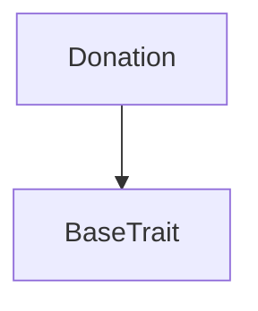
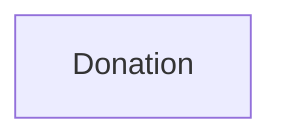

# TACT Compilation Report
Contract: Donation
BOC Size: 1279 bytes

# Types
Total Types: 48

## StateInit
TLB: `_ code:^cell data:^cell = StateInit`
Signature: `StateInit{code:^cell,data:^cell}`

## StdAddress
TLB: `_ workchain:int8 address:uint256 = StdAddress`
Signature: `StdAddress{workchain:int8,address:uint256}`

## VarAddress
TLB: `_ workchain:int32 address:^slice = VarAddress`
Signature: `VarAddress{workchain:int32,address:^slice}`

## Context
TLB: `_ bounced:bool sender:address value:int257 raw:^slice = Context`
Signature: `Context{bounced:bool,sender:address,value:int257,raw:^slice}`

## SendParameters
TLB: `_ bounce:bool to:address value:int257 mode:int257 body:Maybe ^cell code:Maybe ^cell data:Maybe ^cell = SendParameters`
Signature: `SendParameters{bounce:bool,to:address,value:int257,mode:int257,body:Maybe ^cell,code:Maybe ^cell,data:Maybe ^cell}`

## Deploy
TLB: `deploy#946a98b6 queryId:uint64 = Deploy`
Signature: `Deploy{queryId:uint64}`

## DeployOk
TLB: `deploy_ok#aff90f57 queryId:uint64 = DeployOk`
Signature: `DeployOk{queryId:uint64}`

## FactoryDeploy
TLB: `factory_deploy#6d0ff13b queryId:uint64 cashback:address = FactoryDeploy`
Signature: `FactoryDeploy{queryId:uint64,cashback:address}`

## Project$Data
TLB: `null`
Signature: `null`

## DonationData
TLB: `_ donated:uint32 deployer:address id:uint64 owner:address data:Data{title:^string,description:^string,image:^string,link:^string} = DonationData`
Signature: `DonationData{donated:uint32,deployer:address,id:uint64,owner:address,data:Data{title:^string,description:^string,image:^string,link:^string}}`

## DeployDonation
TLB: `deploy_donation#ef6f5d2a data:Data{title:^string,description:^string,image:^string,link:^string} owner:address = DeployDonation`
Signature: `DeployDonation{data:Data{title:^string,description:^string,image:^string,link:^string},owner:address}`

## Donate
TLB: `donate#41146546 amount:coins = Donate`
Signature: `Donate{amount:coins}`

## DonationEvent
TLB: `donation_event#127c35a5 amount:coins from:address = DonationEvent`
Signature: `DonationEvent{amount:coins,from:address}`

## Donation$Data
TLB: `null`
Signature: `null`

## UserData$Data
TLB: `null`
Signature: `null`

## DeployerData
TLB: `_ owner:address projectId:uint64 donationId:uint64 projectPrice:coins balance:coins master:address = DeployerData`
Signature: `DeployerData{owner:address,projectId:uint64,donationId:uint64,projectPrice:coins,balance:coins,master:address}`

## Data
TLB: `_ title:^string description:^string image:^string link:^string = Data`
Signature: `Data{title:^string,description:^string,image:^string,link:^string}`

## NewProject
TLB: `new_project#57350805 address:address id:uint64 data:Data{title:^string,description:^string,image:^string,link:^string} owner:address required:coins percents:dict<int, int> = NewProject`
Signature: `NewProject{address:address,id:uint64,data:Data{title:^string,description:^string,image:^string,link:^string},owner:address,required:coins,percents:dict<int, int>}`

## NewDonation
TLB: `new_donation#c83f5563 address:address id:uint64 owner:address data:Data{title:^string,description:^string,image:^string,link:^string} = NewDonation`
Signature: `NewDonation{address:address,id:uint64,owner:address,data:Data{title:^string,description:^string,image:^string,link:^string}}`

## ChangeOwner
TLB: `change_owner#85a24005 owner:address = ChangeOwner`
Signature: `ChangeOwner{owner:address}`

## ChangeActive
TLB: `change_active#41c3d5cb active:bool = ChangeActive`
Signature: `ChangeActive{active:bool}`

## ChangePrice
TLB: `change_price#d5850a0c projectPrice:coins = ChangePrice`
Signature: `ChangePrice{projectPrice:coins}`

## Withdraw
TLB: `withdraw#49dd9119 query_id:uint64 = Withdraw`
Signature: `Withdraw{query_id:uint64}`

## StageManage
TLB: `stage_manage#59ac100f id:uint64 stage:uint8 = StageManage`
Signature: `StageManage{id:uint64,stage:uint8}`

## ActiveManage
TLB: `active_manage#61c036aa active:bool id:uint64 = ActiveManage`
Signature: `ActiveManage{active:bool,id:uint64}`

## CreateProject
TLB: `create_project#66804c5a data:Data{title:^string,description:^string,image:^string,link:^string} required:coins percents:dict<int, int> owner:address = CreateProject`
Signature: `CreateProject{data:Data{title:^string,description:^string,image:^string,link:^string},required:coins,percents:dict<int, int>,owner:address}`

## CreateDonation
TLB: `create_donation#edd03f5a data:Data{title:^string,description:^string,image:^string,link:^string} owner:address = CreateDonation`
Signature: `CreateDonation{data:Data{title:^string,description:^string,image:^string,link:^string},owner:address}`

## DeployProject
TLB: `deploy_project#00af0154 data:Data{title:^string,description:^string,image:^string,link:^string} required:coins percents:dict<int, int> owner:address = DeployProject`
Signature: `DeployProject{data:Data{title:^string,description:^string,image:^string,link:^string},required:coins,percents:dict<int, int>,owner:address}`

## StageChanged
TLB: `stage_changed#a2d30f85 stage:uint8 = StageChanged`
Signature: `StageChanged{stage:uint8}`

## CheckWallet
TLB: `check_wallet#842ee465 wallet:address sender:address amount:coins = CheckWallet`
Signature: `CheckWallet{wallet:address,sender:address,amount:coins}`

## ChangeStage
TLB: `change_stage#22a535d3 stage:uint8 = ChangeStage`
Signature: `ChangeStage{stage:uint8}`

## OwnerWithdraw
TLB: `owner_withdraw#f16b8c67 amount:coins = OwnerWithdraw`
Signature: `OwnerWithdraw{amount:coins}`

## AddIncome
TLB: `add_income#3815f1a9 ownerPie:bool amount:coins = AddIncome`
Signature: `AddIncome{ownerPie:bool,amount:coins}`

## TransferNotification
TLB: `transfer_notification#7362d09c query_id:uint64 amount:coins sender:address forward_payload:remainder<slice> = TransferNotification`
Signature: `TransferNotification{query_id:uint64,amount:coins,sender:address,forward_payload:remainder<slice>}`

## Validate
TLB: `validate#58bb0635 sender:address amount:coins wallet:address = Validate`
Signature: `Validate{sender:address,amount:coins,wallet:address}`

## AddVots
TLB: `add_vots#eca2354f amount:coins = AddVots`
Signature: `AddVots{amount:coins}`

## MintVots
TLB: `mint_vots#a9d43752 sender:address amount:coins = MintVots`
Signature: `MintVots{sender:address,amount:coins}`

## Invest
TLB: `invest#ec31feb7 amount:coins = Invest`
Signature: `Invest{amount:coins}`

## ProjectData
TLB: `_ voted:coins invested:coins required:coins withdrawn:coins income:coins owner:address id:uint64 stage:uint8 data:Data{title:^string,description:^string,image:^string,link:^string} = ProjectData`
Signature: `ProjectData{voted:coins,invested:coins,required:coins,withdrawn:coins,income:coins,owner:address,id:uint64,stage:uint8,data:Data{title:^string,description:^string,image:^string,link:^string}}`

## Invested
TLB: `invested#93375105 amount:coins from:address = Invested`
Signature: `Invested{amount:coins,from:address}`

## Voted
TLB: `voted#33e14342 amount:coins from:address = Voted`
Signature: `Voted{amount:coins,from:address}`

## Withdrawn
TLB: `withdrawn#45709846 amount:coins from:address = Withdrawn`
Signature: `Withdrawn{amount:coins,from:address}`

## AddInvest
TLB: `add_invest#cf7fb2d3 invested:coins voted:coins = AddInvest`
Signature: `AddInvest{invested:coins,voted:coins}`

## IncomeAdded
TLB: `income_added#27b62596 amount:coins from:address = IncomeAdded`
Signature: `IncomeAdded{amount:coins,from:address}`

## UserWithdraw
TLB: `user_withdraw#37487c77 from:address withdrawnAt:coins voted:coins invested:coins = UserWithdraw`
Signature: `UserWithdraw{from:address,withdrawnAt:coins,voted:coins,invested:coins}`

## GetIncome
TLB: `get_income#05dac8a8 income:coins withdrawnAt:coins = GetIncome`
Signature: `GetIncome{income:coins,withdrawnAt:coins}`

## UserInfo
TLB: `_ totalIncome:coins invested:coins voted:coins withdrawnAt:coins owner:address projectId:uint64 = UserInfo`
Signature: `UserInfo{totalIncome:coins,invested:coins,voted:coins,withdrawnAt:coins,owner:address,projectId:uint64}`

## ProjectsDeployer$Data
TLB: `null`
Signature: `null`

# Get Methods
Total Get Methods: 1

## donationData

# Error Codes
2: Stack underflow
3: Stack overflow
4: Integer overflow
5: Integer out of expected range
6: Invalid opcode
7: Type check error
8: Cell overflow
9: Cell underflow
10: Dictionary error
11: 'Unknown' error
12: Fatal error
13: Out of gas error
14: Virtualization error
32: Action list is invalid
33: Action list is too long
34: Action is invalid or not supported
35: Invalid source address in outbound message
36: Invalid destination address in outbound message
37: Not enough TON
38: Not enough extra-currencies
39: Outbound message does not fit into a cell after rewriting
40: Cannot process a message
41: Library reference is null
42: Library change action error
43: Exceeded maximum number of cells in the library or the maximum depth of the Merkle tree
50: Account state size exceeded limits
128: Null reference exception
129: Invalid serialization prefix
130: Invalid incoming message
131: Constraints error
132: Access denied
133: Contract stopped
134: Invalid argument
135: Code of a contract was not found
136: Invalid address
137: Masterchain support is not enabled for this contract
6959: Not enough income
18451: Wrong amount
44024: Invalid percents
44871: Wrong stage
48540: Not enough tons
56837: Not an owner
57005: Not a deployer
61530: Not active
61739: Wrong sender

# Trait Inheritance Diagram

# Contract Dependency Diagram

